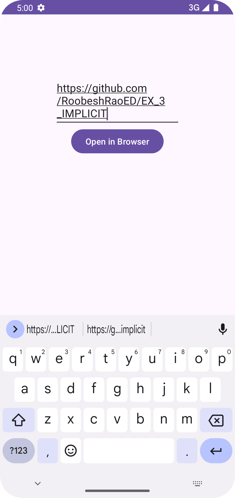
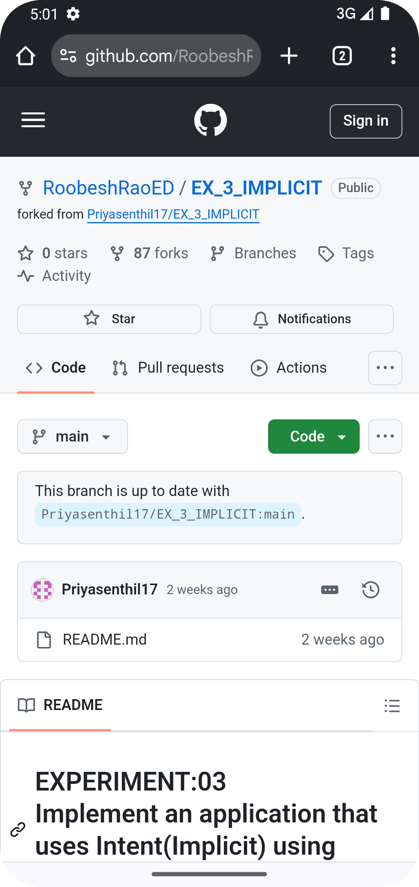

# EXPERIMENT:03  Implement an application that uses Intent(Implicit) using Android Studio.

Design an Android application with a text field and an "Open in Browser" button. On pressing the button, the app should fetch the URL from the text field and open it in a browser using an Implicit Intent.

## AIM:

To design an Android application with a TextField and a button labeled "Open in Browser." Upon pressing the button, the application should retrieve the URL entered in the TextField and open it in the device's web browser using an implicit intent.
## EQUIPMENTS REQUIRED:

Latest Version Android Studio

## ALGORITHM:

Step 1: Create a New Android Project:
- Open Android Studio and click on "New Project."
- Select "Empty Activity" and click "Next."
- Enter the application name, project name, and desired package name.
- Choose a launcher icon and click "Finish."

Step 2: Design the Layout:
- Open `activity_main.xml` in the `res/layout` folder.
- Add an EditText for the URL input.
- Add a Button labeled "Open in Browser."

Step 3: Initialize UI Components:
- Open `MainActivity.java` and retrieve references to the EditText and Button.

Step 4: Set OnClickListener for the Button:
- Implement an OnClickListener for the Button to handle click events.

Step 5: Retrieve the URL from the EditText:
- In the click listener, get the text entered in the EditText.

Step 6: Validate the URL:
- Check if the entered URL is not empty. If empty, display a message to the user.

Step 7: Create an Implicit Intent:
- If the URL is valid, create an implicit intent to open the URL in the web browser.

Step 8: Start the Intent:
- Use the intent to start the browser activity with the specified URL.

Step 9: Test the Application:
- Run the application on an emulator or physical device.
- Enter a valid URL and click the Button to ensure it opens in the browser.

Step 10: Handle Edge Cases (Optional):
- Consider implementing error handling for invalid URLs or providing user guidance.

## PROGRAM:
### MainActivity.java:
```
package com.example.ex3;

import android.content.Intent;
import android.net.Uri;
import android.os.Bundle;
import android.view.View;
import android.widget.Button;
import android.widget.EditText;

import androidx.appcompat.app.AppCompatActivity;

public class MainActivity extends AppCompatActivity {

    Button button;

    EditText editText;
    @Override
    protected void onCreate(Bundle savedInstanceState) {
        super.onCreate(savedInstanceState);
        setContentView(R.layout.activity_main);
        final EditText editText = (EditText) findViewById(R.id.urlText);
        Button btn = (Button) findViewById(R.id.btnNavigate);
        btn.setOnClickListener(new View.OnClickListener() {
            @Override
            public void onClick(View v) {
                String url = editText.getText().toString();
                Intent intent = new Intent(Intent.ACTION_VIEW, Uri.parse(url));
                startActivity(intent);
            }
        });
    }
}
```
### Activity_main.xml:
```
<?xml version="1.0" encoding="utf-8"?>
<RelativeLayout
    xmlns:android="http://schemas.android.com/apk/res/android"
    xmlns:tools="http://schemas.android.com/tools"
    android:layout_width="match_parent"
    android:layout_height="match_parent">

    <EditText
        android:layout_width="wrap_content"
        android:layout_height="wrap_content"
        android:id="@+id/urlText"
        android:layout_alignParentTop="true"
        android:layout_centerHorizontal="true"
        android:layout_marginTop="100dp"
        android:ems="10" />
    <Button
        android:layout_width="wrap_content"
        android:layout_height="wrap_content"
        android:id="@+id/btnNavigate"
        android:layout_below="@+id/urlText"
        android:text="Open in Browser"
        android:layout_centerHorizontal="true" />
</RelativeLayout>
```
## OUTPUT:

                        



## RESULT:

Thus a Simple Android Application create a navigate button using Implicit Intent to display the web page using Android Studio was developed and executed successfully.
